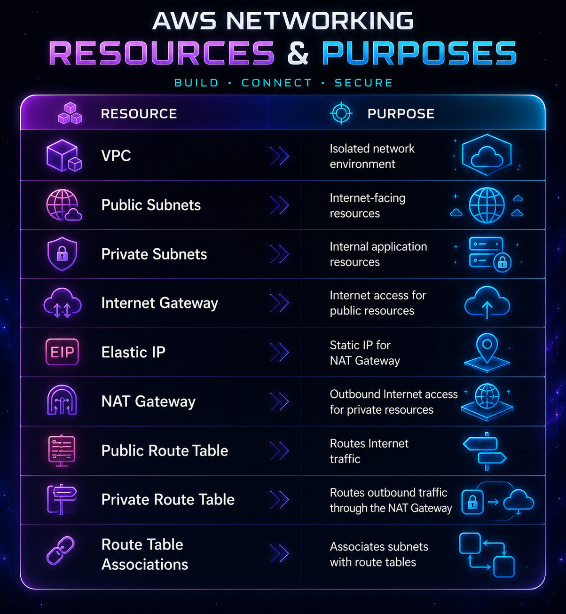
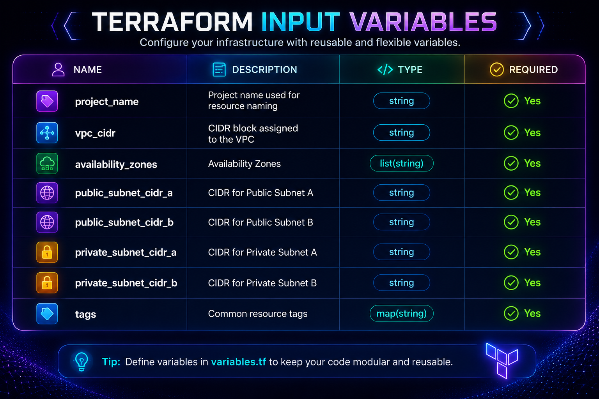
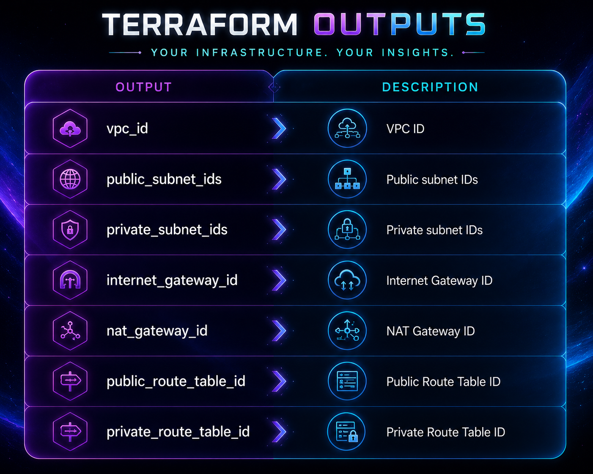
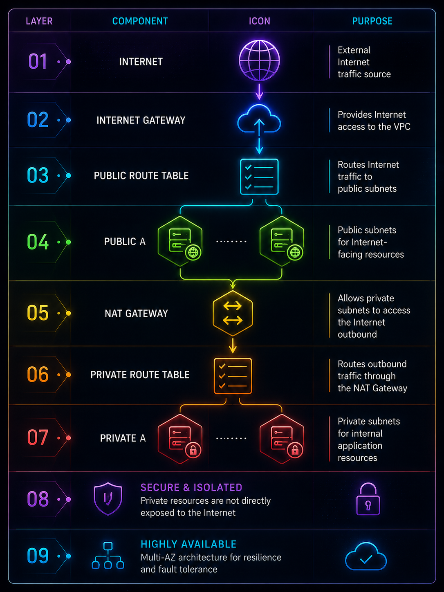

# Networking Module

## Overview

The Networking module provisions the foundational networking infrastructure for the MathLab AI AWS environment.

It creates a highly available Virtual Private Cloud (VPC) spanning two Availability Zones and provides secure routing between public and private resources.

This module is the foundation upon which all other infrastructure components are deployed.

---

# Features

- Creates a Virtual Private Cloud (VPC)
- Creates two public subnets
- Creates two private subnets
- Creates an Internet Gateway
- Creates a NAT Gateway
- Allocates an Elastic IP for the NAT Gateway
- Creates public and private route tables
- Associates route tables with subnets
- Supports Multi-AZ deployment
- Applies consistent resource tagging

---

# Resources Created



---

# Inputs



---

# Outputs



---

# Architecture



---

# Dependencies

This module has no dependencies.

It is deployed before all other infrastructure modules.

---

# Best Practices

This module follows AWS networking best practices by:

- Deploying resources across multiple Availability Zones.
- Isolating application instances in private subnets.
- Using a NAT Gateway for outbound Internet access.
- Restricting inbound traffic to public-facing components only.
- Applying consistent resource tagging.

---

# Example Usage

```hcl
module "networking" {
  source = "../../modules/networking"

  project_name = var.project_name

  vpc_cidr = var.vpc_cidr

  availability_zones = local.availability_zones

  public_subnet_cidr_a = var.public_subnet_cidr_a
  public_subnet_cidr_b = var.public_subnet_cidr_b

  private_subnet_cidr_a = var.private_subnet_cidr_a
  private_subnet_cidr_b = var.private_subnet_cidr_b

  tags = local.common_tags
}
```

---

# Notes

This module is intentionally isolated from compute resources to promote modularity, reuse, and maintainability. All networking resources are provisioned before dependent modules such as Security Groups, Application Load Balancer, Launch Template, and Auto Scaling.
