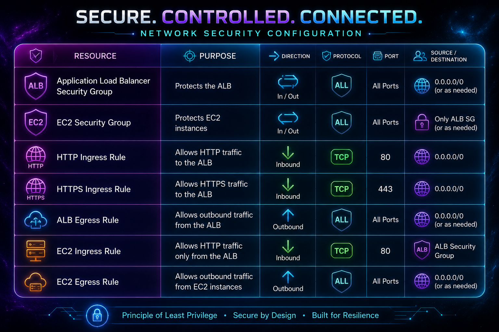
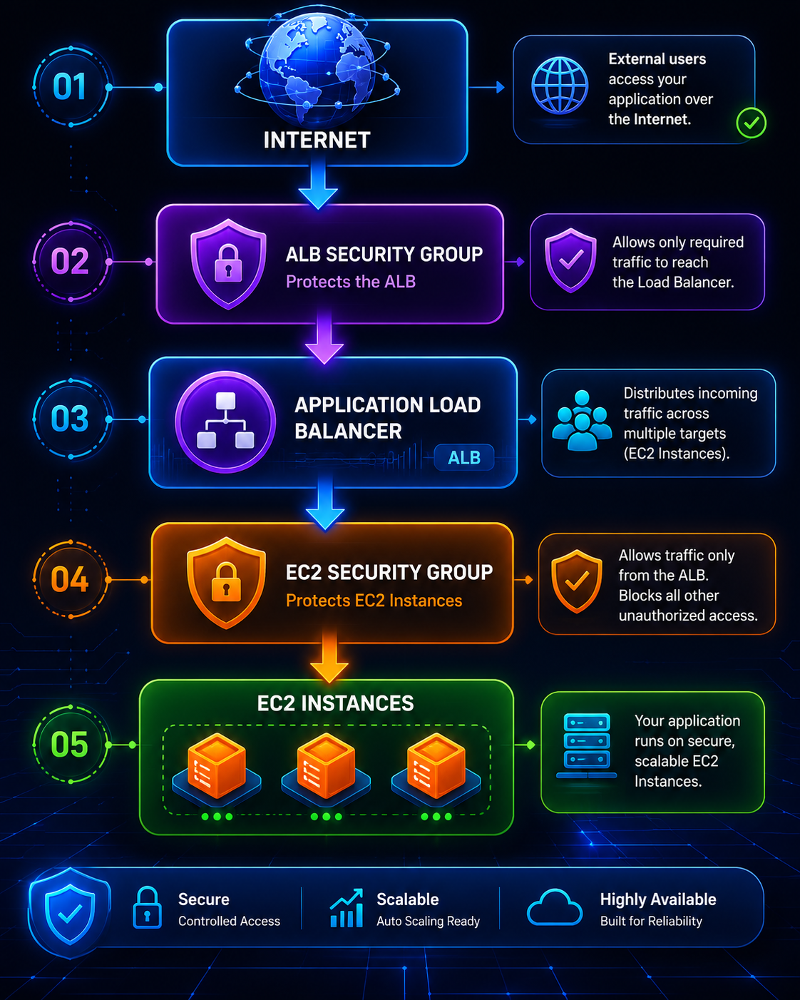

# Security Group Module

## Overview

The Security Group module provisions the network security controls for the MathLab AI Infrastructure.

It creates separate Security Groups for the Application Load Balancer (ALB) and the EC2 instances, implementing a layered security model based on the principle of least privilege.

The module ensures that only the required network traffic is permitted while denying all unnecessary inbound access.

---

# Features

- Creates an Application Load Balancer Security Group
- Creates an EC2 Security Group
- Allows HTTP traffic from the Internet to the ALB
- Allows HTTPS traffic from the Internet to the ALB
- Allows HTTP traffic from the ALB to EC2 instances
- Restricts direct Internet access to EC2 instances
- Allows outbound traffic required for application communication
- Applies consistent resource tagging

---

# Resources Created



---

# Security Architecture



Direct Internet access to EC2 instances is not permitted.

---

# Inbound Rules

## Application Load Balancer

| Protocol | Port | Source    |
| -------- | ---- | --------- |
| HTTP     | 80   | 0.0.0.0/0 |
| HTTPS    | 443  | 0.0.0.0/0 |

---

## EC2

| Protocol | Port | Source                                   |
| -------- | ---- | ---------------------------------------- |
| HTTP     | 80   | Application Load Balancer Security Group |

No other inbound connections are permitted.

---

# Outbound Rules

## Application Load Balancer

| Protocol | Destination |
| -------- | ----------- |
| All      | 0.0.0.0/0   |

---

## EC2

| Protocol | Destination |
| -------- | ----------- |
| All      | 0.0.0.0/0   |

---

# Inputs

| Name         | Description                                | Type        | Required |
| ------------ | ------------------------------------------ | ----------- | -------- |
| project_name | Project name used for naming AWS resources | string      | Yes      |
| vpc_id       | VPC ID                                     | string      | Yes      |
| tags         | Common resource tags                       | map(string) | Yes      |

---

# Outputs

| Output                | Description                                 |
| --------------------- | ------------------------------------------- |
| alb_security_group_id | Application Load Balancer Security Group ID |
| ec2_security_group_id | EC2 Security Group ID                       |

---

# Dependencies

This module depends on:

- Networking Module

Required input:

- VPC ID

---

# Best Practices

The module follows AWS security best practices by:

- Applying the Principle of Least Privilege
- Separating Security Groups by resource type
- Restricting EC2 access to the ALB only
- Preventing direct Internet access to EC2 instances
- Using Security Group references instead of CIDR blocks where appropriate
- Applying consistent resource tagging

---

# Example Usage

````hcl
module "security_groups" {
  source = "../../modules/security-group"

  project_name = var.project_name

  vpc_id = module.networking.vpc_id

  tags = local.common_tags
}
```text

---

# Operational Notes

Only the Application Load Balancer is exposed to the public Internet.

All application traffic must follow this path:

```text
Internet
      │
      ▼
Application Load Balancer
      │
      ▼
EC2 Instances
````

This architecture significantly reduces the attack surface by ensuring that compute resources remain isolated within private subnets.

---

# Maintenance

When modifying this module:

- Review all inbound rules.
- Validate outbound rules.
- Ensure Security Group references remain correct.
- Run `terraform validate`.
- Review the Terraform execution plan before deployment.

---

# Conclusion

The Security Group module provides network-level protection for the MathLab AI Infrastructure by enforcing controlled communication between AWS resources. By limiting inbound access and following AWS security best practices, the module contributes to a secure, scalable, and production-ready cloud architecture.
